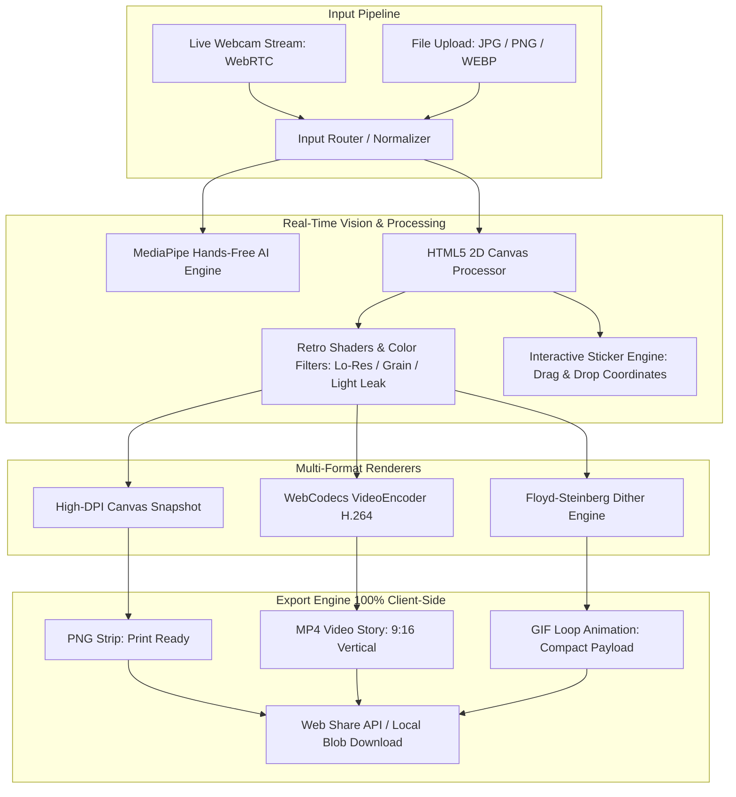

<div align="center">

# 📸 PHOTOBOOTH STUDIO — Client-Side Multimedia Web Application

**High-Performance Neo-Brutalist Photobooth with On-Device AI Vision, Hardware-Accelerated Video Encoding & Zero-Server Privacy Architecture**

[](https://photobooth.pangestudev.web.id)
[](https://react.dev/)
[](https://vitejs.dev/)
[](https://tailwindcss.com/)
[](https://developers.google.com/mediapipe)
[](https://w3c.github.io/webcodecs/)
[](https://en.wikipedia.org/wiki/Client-side)

<p align="center">
  <a href="https://photobooth.pangestudev.web.id">🌐 Launch Photobooth</a> •
  <a href="#-executive-summary-why-this-project-stands-out">Why This Project Stands Out</a> •
  <a href="#-key-architectural-highlights--engineering-decisions">Engineering Highlights</a> •
  <a href="#-technical-stack--system-architecture">Architecture & Tech Stack</a> •
  <a href="#-feature-matrix">Feature Matrix</a> •
  <a href="#-developer-profile--contact">Developer Contact</a>
</p>

</div>

---

## 📌 Executive Summary: Why This Project Stands Out

**Photobooth Studio** is an advanced, offline-first client-side web application engineered by **Urip Yoga Pangestu** (`pangestudev`). While traditional web photobooths rely on basic `<canvas>` snapshots or heavy backend rendering servers, this application executes **end-to-end computer vision, real-time image processing, and hardware-accelerated video rendering completely within the client's browser**.

### 💡 Core Engineering Highlights:
- 🖐️ **On-Device Computer Vision**: Google MediaPipe AI Vision tracks hands-free gestures (5-finger open palm) via client-side WebAssembly—no frames ever sent to external cloud servers.
- ⚡ **Zero-Server Video Encoding**: Uses the bleeding-edge browser **WebCodecs API** (`VideoEncoder` + `mp4-muxer`) to transcode multi-slot video recordings into standardized H.264 MP4 videos in real time with hardware acceleration.
- 🎨 **Floyd-Steinberg Error-Diffusion Dithering**: Custom algorithmic dithering implementation for retro GIF animations with ultra-compact file footprints.
- 🛡️ **Zero-Server Upload (100% Privacy by Design)**: Zero database, zero cloud storage, zero tracking. All processing lives strictly in browser RAM, ensuring zero vulnerability to data leaks.
- 🖼️ **Dual-Input Pipeline (Camera & Local File Upload)**: Supports live front/rear camera streaming with mirrored viewport toggles, as well as multi-file drag-and-drop upload with smart center-cropping.

---

## 🏗️ Technical Stack & System Architecture



### 🛠️ Technology Stack Breakdown

| Layer | Technologies | Engineering Purpose & Implementation |
| :--- | :--- | :--- |
| **Frontend Framework** | `React 19` + `Vite 7` | Ultra-fast HMR, component lifecycle optimization, sub-second production builds |
| **Styling & Aesthetics** | `Tailwind CSS` + Neo-Brutalism | High-contrast tactile design, customized drop-shadows, responsive mobile viewport |
| **Computer Vision / AI** | `@mediapipe/camera_utils` + `hands` | On-device hand landmark detection running client-side WASM models with zero latency |
| **Hardware Video Encoding** | `WebCodecs API` (`VideoEncoder`) | Native browser GPU/hardware H.264 video encoding without heavy server FFmpeg clusters |
| **Container Muxing** | `mp4-muxer` | Fast, pure-JavaScript MP4 container muxing from raw encoded AVC1 chunks |
| **GIF Encoding & Dither** | `gifenc` + Custom Floyd-Steinberg | 256-color palette quantization, error-diffusion matrix, memory-efficient byte buffering |
| **Audio Feedback** | Native `Web Audio API` | Pure mathematical frequency synthesis (shutter click & countdown beeps) at **0 KB network cost** |
| **Privacy & Security** | `FileReader` + Local Object URLs | Zero server data retention; volatile in-memory lifecycle with automatic `revokeObjectURL` cleanup |

---

## 🔬 Deep-Dive: Architectural Solutions & Engineering Challenges

### 1. Hands-Free Gesture Recognition without False Positives
- **Problem**: Continuous computer vision detection can lead to debounced loops where a user holding up their hand triggers non-stop continuous photo captures.
- **Solution**: Engineered a robust **FSM (Finite State Machine)** with a 4.5-second cooldown cycle and spatial confidence gating:
  - Validates 5 extended finger tips relative to MCP joints.
  - Requires 500ms of sustained gesture confidence before starting countdown.
  - Locks out gesture listening during active photo countdowns and re-engages safely after layout capture finishes.

### 2. Native WebCodecs H.264 Video Multiplexing vs Serverless FFmpeg
- **Problem**: Generating animated MP4 video strips traditionally requires sending MBs of images to an AWS Lambda / Cloud Run FFmpeg service, inducing high server egress costs and privacy concerns.
- **Solution**: Implemented browser-native `VideoEncoder` using H.264 Baseline Profile (`avc1.42001f`) paired with `mp4-muxer`:
  - Canvas renders synchronized frames at 30 FPS.
  - Directly pipes `VideoFrame` objects into hardware encoders.
  - Fallbacks seamlessly to `MediaRecorder` with WebM/MP4 cross-browser compatibility on older mobile devices.

### 3. High-Fidelity Retro Filters & Floyd-Steinberg Dithering
- **Y2K Lo-Res Digicam Simulation**: Simulates the authentic optical sensor bloom of early 2000s digital compact cameras by downsampling canvas buffers to low sensor resolutions, injecting digital noise, applying contrast curves, and scaling back up with bilinear interpolation.
- **Dithering Engine**: Implements the classic **Floyd-Steinberg error diffusion algorithm** in vanilla JavaScript to disperse quantization error across neighboring pixels, eliminating color banding in exported GIF loops.

### 4. Dual Input & Memory Leak Management
- **Smart Center-Crop**: Uploaded images of arbitrary dimensions (panoramic, 16:9, vertical portraits) are calculated with zero distortion and center-cropped to square slots matching the photobooth layout.
- **Lifecycle Cleanup**: All video recording URLs, image data blobs, and canvas contexts are systematically revoked via `URL.revokeObjectURL()` during layout resets and retakes, preventing RAM bloat on low-memory mobile phones.

---

## ✨ Complete Feature Matrix

| Feature Category | Capabilities & Specifications |
| :--- | :--- |
| **📷 Capture Modes** | **Foto Studio** (Multi-pose strip), **Upload Foto** (Batch file upload / drag-and-drop), **Video Klip** (15 detik multi-slot video) |
| **🖐️ Hands-Free AI** | 5-Finger palm gesture recognition, visual green HUD feedback, 4.5s intelligent cooldown |
| **🎨 10+ Retro Filters** | *Normal*, *Light Leak 35mm*, *Lo-Res Digicam*, *Film Grain 800*, *Golden Hour*, *Anime Pastel*, *Cyberpunk*, *B&W High Contrast*, *Vintage Warm*, *Sepia 1920* |
| **🖼️ Frame & Layout Customizer** | 4-Pose Classic, 3-Pose Cinema, 2-Pose Wide, 6-Pose Twin, 9-Pose Film; Custom Hex Color Picker, Checkerboard, Polka Dots, Grid patterns |
| **🏷️ Sticker & Typography Studio** | Drag-and-drop positionable retro stickers, DigiCam quartz date stamp (Orange LCD font), custom typography caption banner |
| **📦 Multi-Format Export** | **PNG** (High-DPI print ready), **MP4 Video** (15s vertical 9:16 Instagram Story), **GIF Loop** (Floyd-Steinberg dithered animation) |
| **🔄 Single-Slot Retake Mode** | Click any specific pose to retake or replace only that photo without resetting the rest of the strip |
| **💡 Studio Assist Tools** | Virtual Screen Ring Light (White, Warm Golden, Soft Rose), Composition Rule-of-Thirds Grid, Mirror Flip Toggle |

---

## 🚀 Local Development Setup

### 1. Prerequisites
- **Node.js**: `v18.0.0+`
- **Package Manager**: `npm`, `pnpm`, or `bun`
- A working webcam or built-in camera for live video testing

### 2. Installation & Quick Start

```bash
# Clone the repository
git clone https://github.com/timurlauttt/photo-booth.git
cd photo-booth-v1.0.0

# Install dependencies
npm install

# Start Vite development server
npm run dev
# Application running at http://localhost:5173
```

### 3. Production Build & Linter

```bash
# Run ESLint validation
npm run lint

# Compile optimized production bundle
npm run build
```

---

## 👨‍💻 Developer Profile & Contact

This project is designed and engineered with love by **Urip Yoga Pangestu** (`pangestudev`).

- **Role**: Junior Full Stack Web Developer & DevOps Enthusiast
- **Certifications**:
  - **BNSP Certified Web Developer** *(Badan Nasional Sertifikasi Profesi)*
  - **Google AI Professional Certificate**
  - **Google Cybersecurity Certificate**
- **Core Stack**: React.js, Vite, Tailwind CSS, Laravel 11/12, PHP 8.2, Node.js, Linux VPS, Nginx, Docker

### 📬 Recruitment & Collaboration Inquiries:

<div align="center">

| Channel | Link |
| :--- | :--- |
| **🌐 Portfolio Website** | [pangestudev.web.id](https://pangestudev.web.id) |
| **💼 LinkedIn** | [linkedin.com/in/urip-yoga-pangestu-65a541231](https://www.linkedin.com/in/urip-yoga-pangestu-65a541231/) |
| **📧 Direct Email** | [hello@pangestudev.web.id](mailto:hello@pangestudev.web.id?subject=Photobooth%20Project%20Inquiry%20/%20Hiring) |
| **💬 WhatsApp** | [+62 858-6146-6287](https://wa.me/6285861466287?text=Halo%20Urip,%20kami%20tertarik%20dengan%20proyek%20Photobooth%20Anda) |
| **🐙 GitHub** | [@timurlauttt](https://github.com/timurlauttt) |

</div>

---

<div align="center">
  <p>© 2026 <strong>pangestudev</strong> (@timurlauttt). Strictly for personal & free fun use only.</p>
  <p>Engineered with modern web standards and client-side privacy.</p>
</div>
